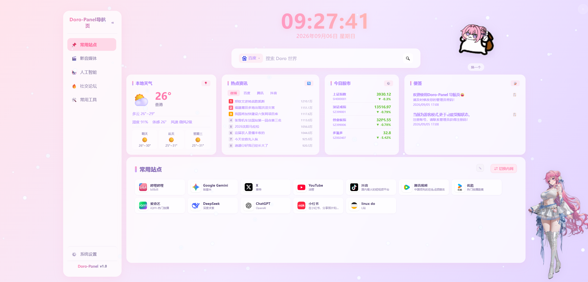
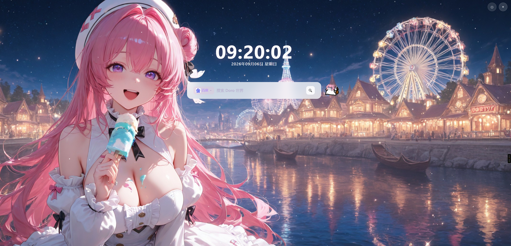
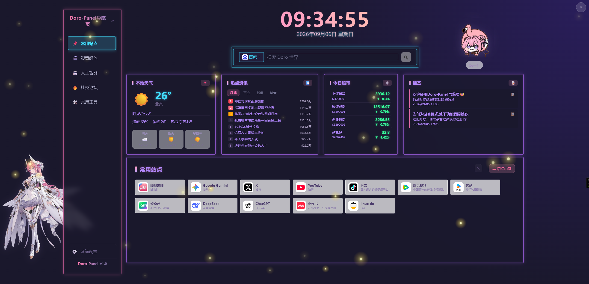

# Doro-Panel 导航面板


一个功能丰富的自托管导航面板，支持多用户、多主题、立绘表情包、股票天气等功能。

---

## 🖼️ 项目预览

### 默认主题（粉紫渐变）


### 极简模式


### 霓虹像素主题


---

## ✨ 功能特性

### 🎨 主题与外观
- **三套内置主题** - 默认粉紫渐变、机甲科技、霓虹像素
- **极简模式** - 纯净搜索页，独立壁纸和特效
- **7种面板特效** - 粒子、星空、雨滴等动态背景

### 👥 多用户系统
- **多用户数据隔离** - 每个用户独立的网站、分类、设置
- **三级权限体系** - 普通用户 / 管理员 / admin超级管理员
- **admin专属权限** - 仅admin可修改其他用户密码、升级/降级管理员
- **注册码机制** - 管理员生成注册码，控制用户注册
- **admin账户保护** - 不可删除、不可修改用户名、不可修改角色

### 🖼️ 立绘与表情包
- **左右独立立绘** - 支持左右两侧分别设置不同立绘
- **立绘轮换** - 多张立绘自动轮换，可调节大小和位置
- **默认5张Dorothy立绘** - 新安装默认关闭立绘
- **表情包系统** - 默认7张表情包，用户可上传自定义
- **上传数量限制** - 壁纸15张 / 表情包20张 / 立绘30张（单用户）

### 📊 实用功能
- **股票行情** - 实时A股/港股行情，支持上证指数等指数
- **实时天气** - 自动IP定位或手动设置城市
- **热点资讯** - 每日60秒新闻，自动刷新
- **多引擎搜索** - 百度/谷歌/必应一键切换
- **分类上锁** - 支持分类加密，一次解锁所有上锁分类
- **隐藏网站** - 仅登录后可见，带🔒标记

### 🔧 管理功能
- **数据备份** - 站点导入导出（CSV格式），方便迁移
- **恢复出厂设置** - 仅管理员可操作，不删除用户上传素材
- **系统日志** - 管理员可查看登录日志和操作日志
- **清除缓存** - 一键清除浏览器缓存，解决更新不同步
- **Docker部署** - 支持X86和ARM多架构

---

## 🚀 快速开始

### Docker 部署

```bash
# 1. 创建数据目录
mkdir -p /home/docker/doro-panel

# 2. 启动容器
docker run -d \
  --name doro-panel \
  -p 8086:8080 \
  -v /home/docker/doro-panel:/app/data \
  -e TZ=Asia/Shanghai \
  --restart unless-stopped \
  wxp0577/doro-panel:latest
```

### Docker Compose 部署

下载项目中的 `docker-compose.yml`，然后执行：

```bash
docker-compose up -d
```

### 访问

打开浏览器访问：`http://你的服务器IP:8086`

**默认账号：** `admin` / `admin`

> ⚠️ 首次登录后请及时修改密码！

---

## 📦 支持架构

| 架构 | 说明 |
|------|------|
| `linux/amd64` | X86架构（普通PC、服务器） |
| `linux/arm64` | ARM架构（树莓派、飞牛NAS、绿联NAS等） |

---

## 🐳 Docker Hub

**镜像地址：** https://hub.docker.com/r/wxp0577/doro-panel

### 拉取镜像

```bash
# 最新版
docker pull wxp0577/doro-panel:latest

# 指定版本
docker pull wxp0577/doro-panel:v1.0
```

### 更新镜像

```bash
# 停止并删除旧容器
docker stop doro-panel
docker rm doro-panel

# 拉取最新镜像
docker pull wxp0577/doro-panel:latest

# 重新启动（数据不会丢失，存在/home/docker/doro-panel目录中）
docker run -d \
  --name doro-panel \
  -p 8086:8080 \
  -v /home/docker/doro-panel:/app/data \
  -e TZ=Asia/Shanghai \
  --restart unless-stopped \
  wxp0577/doro-panel:latest
```

---

## ⚙️ 环境变量

| 变量名 | 默认值 | 说明 |
|--------|--------|------|
| `PORT` | `8080` | 服务监听端口 |
| `HOST` | `0.0.0.0` | 监听地址 |
| `DATA_DIR` | `/app/data` | 数据存储目录 |
| `TZ` | `Asia/Shanghai` | 时区 |
| `ADMIN_USERNAME` | `admin` | 管理员用户名（仅首次初始化生效） |
| `ADMIN_PASSWORD` | `admin` | 管理员密码（仅首次初始化生效） |
| `SECRET_KEY` | 内置默认值 | 应用密钥（生产环境建议修改） |

> 📌 环境变量中的管理员账号密码仅在**首次初始化数据库**时生效。如果数据库已存在，修改环境变量不会更改密码，请在页面「系统设置」中修改。

---

## 💾 数据持久化

所有数据（网站配置、分类、股票、用户、设置、上传的壁纸/表情包/立绘）存储在 `/home/docker/doro-panel` 目录中。

### 备份数据

```bash
# 直接复制数据目录
cp -r /home/docker/doro-panel /home/docker/doro-panel-backup
```

### 恢复数据

```bash
# 停止容器
docker stop doro-panel

# 恢复数据目录
rm -rf /home/docker/doro-panel
cp -r /home/docker/doro-panel-backup /home/docker/doro-panel

# 重新启动
docker start doro-panel
```

---

## 📖 使用说明

### 1. 登录与账号
- 点击左下角「系统设置」→「用户」→「去登录」
- 默认账号：`admin` / `admin`
- 登录后可在「系统设置」→「用户」中修改密码
- admin账户不允许修改用户名

### 2. 添加网站
- 登录后，每个分类页面右上角点击「✏️ 编辑」进入编辑模式
- 点击「➕ 添加」添加新网站
- 输入网址后自动获取favicon，也可使用纯色文字图标（自定义背景色）
- 可设置「隐藏」（仅登录可见，带🔒标记）
- 编辑模式下拖拽网站卡片可排序

### 3. 首页常用站点
- 首页「常用站点」是从其他分类选取的网站引用
- 点击「编辑」→「添加」，从其他分类选择网站显示在首页
- 支持内网/外网分别设置
- 删除首页的网站不会影响其他分类中的原网站

### 4. 管理分类
- 编辑模式下，左侧分类栏底部出现「➕ 添加分类」
- 悬停分类可编辑（✏️）或删除（🗑️）
- 首页「常用站点」分类不可删除、不可重命名
- 支持emoji图标选择器
- 支持分类上锁，解锁需输入密码，一次解锁所有上锁分类

### 5. 股票管理
- 登录后，股票卡片右上角点击「⚙️」
- 输入股票代码添加：
  - A股：`600519`（贵州茅台）、`000001`（上证指数）、`399006`（创业板指）
  - 港股：`00700`（腾讯控股）、`HSI`（恒生指数）
- 常见指数代码会自动识别
- 可设置显示/隐藏，点击股票查看详情

### 6. 立绘与表情包
- 在「系统设置」→「立绘」中开启左右立绘
- 支持上传自定义立绘，默认5张Dorothy立绘
- 新安装默认关闭立绘
- 表情包在聊天框中使用，默认7张，可上传自定义
- 单用户上传上限：壁纸15张 / 表情包20张 / 立绘30张

### 7. 主题设置
- 在「系统设置」→「主题」中切换内置主题
- 三套内置主题：默认粉紫渐变、机甲科技、霓虹像素
- 支持极简模式，独立壁纸和特效

### 8. 数据备份与恢复
- 在「系统设置」→「数据备份」中导出/导入站点配置
- 导出格式为CSV，包含分类、网址、名称、简介
- 仅备份除首页外的其他分类站点
- 方便重装服务器后快速导入网站

### 9. 恢复出厂设置
- 仅管理员可操作
- 需要输入 `RESET` 确认
- 恢复后所有网站、分类、设置重置为默认
- **不会删除**用户上传的壁纸、表情包、立绘等素材
- 用户上传的素材需手动到服务器数据目录删除

---

## ❓ 常见问题

**Q: 股票行情不更新？**
A: 检查容器网络是否能访问 `hq.sinajs.cn`，国内服务器一般正常。

**Q: 天气显示定位失败？**
A: 可在天气设置中手动输入城市名称。

**Q: 网站favicon获取失败？**
A: 自动切换为纯色文字图标，可自定义背景颜色。

**Q: 如何修改端口？**
A: 修改docker run命令中的端口映射，如 `-p 80:8080` 表示外部80端口映射到容器8080。

**Q: 数据会丢失吗？**
A: 数据存储在 `/home/docker/doro-panel` 目录中，只要不删除这个目录，重建容器数据不会丢失。

**Q: 更新后功能没变化？**
A: 可能是浏览器缓存，按 `Ctrl+F5` 强制刷新，或在「系统设置」中点击「清除缓存」。

**Q: 容器无限重启？**
A: 查看日志 `docker logs doro-panel`，常见原因是数据目录权限问题，确保挂载的目录可写。

**Q: 如何查看系统日志？**
A: 管理员登录后，在「系统设置」→「日志」中查看，包含登录信息和操作记录。

---

## 📝 更新日志

详见 [CHANGELOG.md](./CHANGELOG.md)

---

## 🛠️ 技术栈

- **后端**: Python 3.12 + Flask + Gunicorn
- **数据库**: SQLite（零配置，单文件）
- **前端**: 原生 HTML/CSS/JavaScript（无框架依赖）
- **部署**: Docker + Docker Compose

---

## ⚠️ 版权声明

本项目中内置的默认壁纸、立绘、表情包等图片素材**仅供参考演示使用**，部分素材可能来源于网络，不建议直接用于商业用途。

你可以在「系统设置」中自行上传替换为你拥有版权或免费可商用的图片素材：
- 壁纸：单用户最多上传15张
- 立绘：单用户最多上传30张
- 表情包：单用户最多上传20张

---

## 📄 许可证

MIT License

---

## ⭐ 支持项目

如果这个项目对你有帮助，欢迎点个Star ⭐


